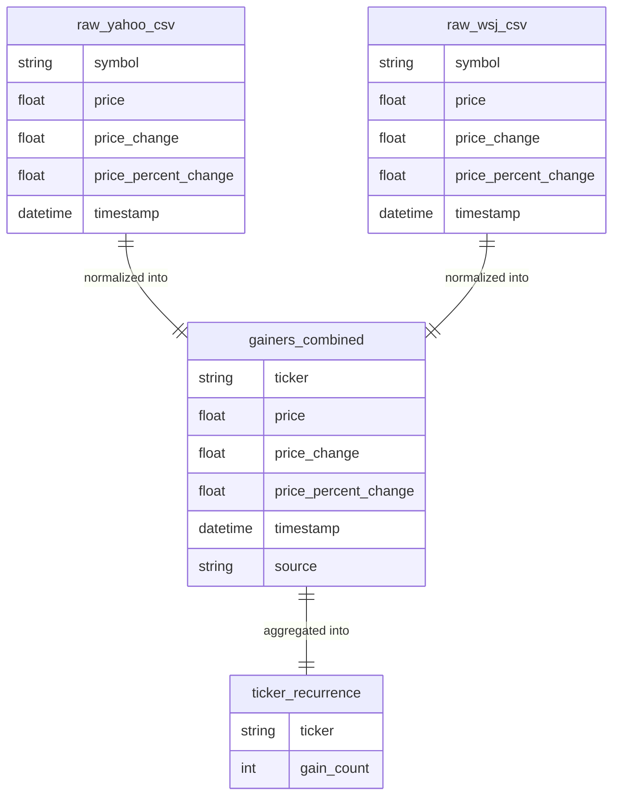
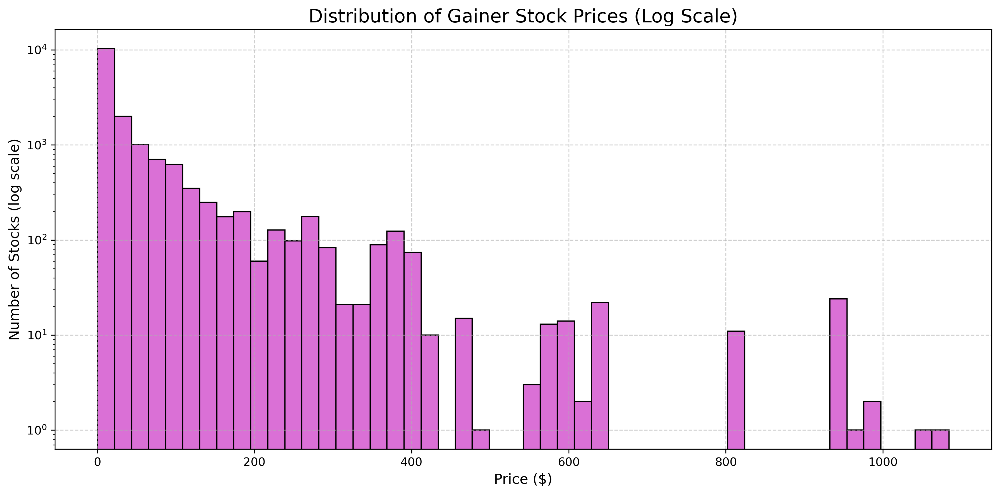
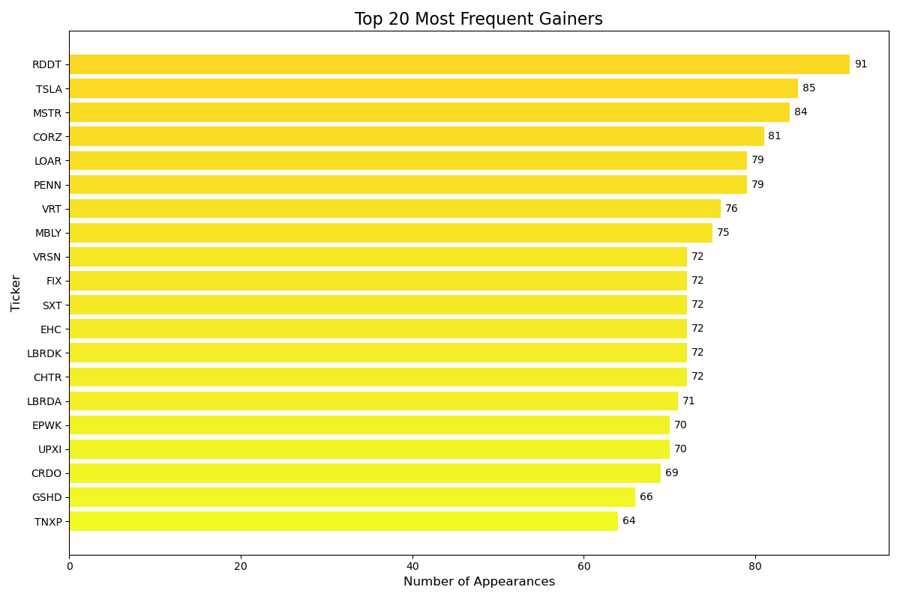
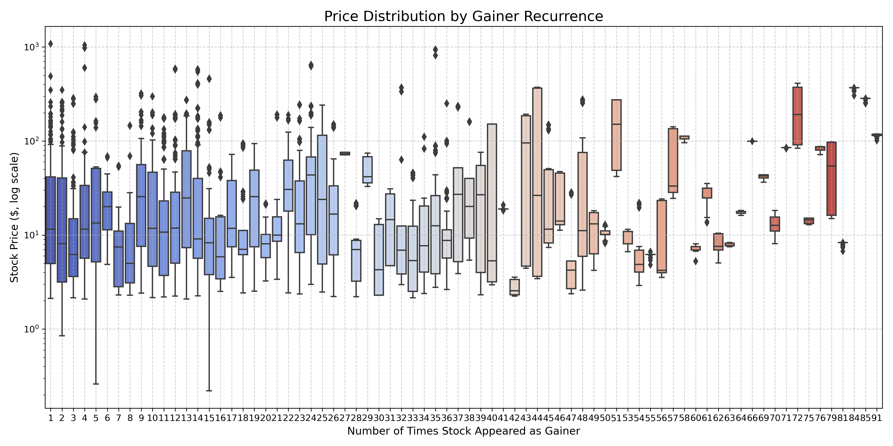
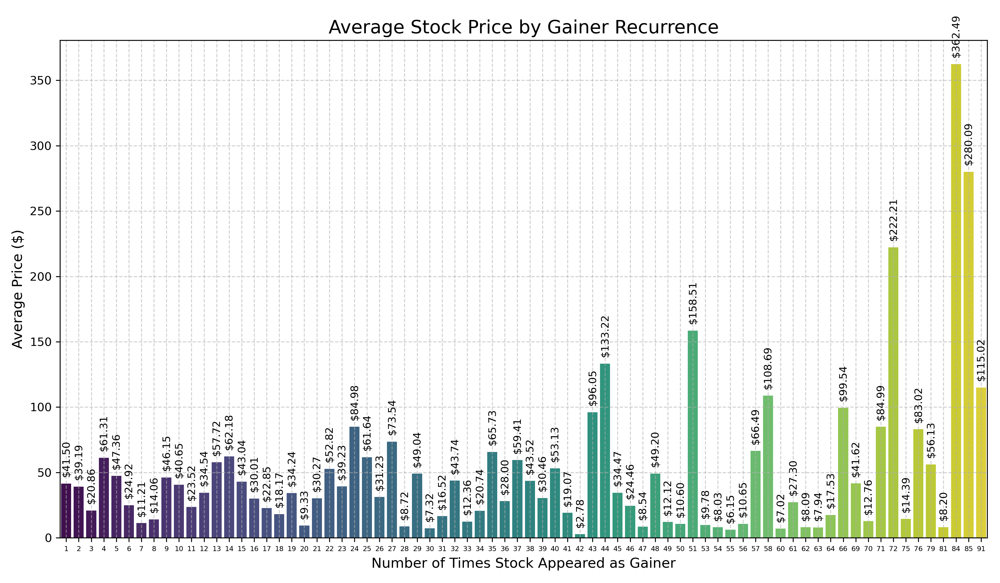

# Gainers Report: Stock Movement Analysis

---

## Overview

This report presents a summary analysis of daily stock gainer data collected from **Yahoo Finance** and the **Wall Street Journal** over several weeks. The goal is to consolidate and process this data to uncover patterns in symbol recurrence and price behavior, and to provide insight into the kinds of stocks that frequently appear as top gainers.

We aim to answer the question:

> **Which stocks appear repeatedly as top gainers?**

---

## Entity-Relationship Diagram

---

## **Use Cases**:

### Highlight Recurring Stocks

Identify symbols that show up across multiple days as consistent gainers.
    
### Price Range Insights
    
Understand whether recurring gainers tend to be lower-priced or higher-priced stocks.
    
### Behavior Patterns
    
Compare stock price distributions and averages by how frequently each ticker appears.

---

## **Methods:**

### Data Collection

Gainer CSVs are scraped from Yahoo and WSJ via automated cron jobs.
    
### Normalization

Each CSV is normalized to a shared schema:
    
    	TICKER, PRICE, PRICE_CHANGE, PRICE_PERCENT_CHANGE, TIMESTAMP, SOURCE
     
Normalized data is loaded into a Snowflake STOCKS table.

### Aggregation
	
A recurrence count is computed for each ticker to see how often it appears.

---

## **Visual Insights:**

See attached charts:

This histogram shows the distribution of stock prices for all gainers. Most are under $100, but there are notable outliers above $500.

These are the stocks that appeared most frequently as top gainers across the dataset, led by RDDT, TSLA, and MSTR.

Boxplots comparing stock price ranges grouped by how often a ticker appeared. Recurring gainers show diverse pricing behavior.

This chart displays the average stock price for tickers based on how frequently they appeared as gainers. Higher-frequency gainers often have higher average prices.

---

## **Summary:**

This analysis pipeline consolidates gainer data into a clean format and reveals trends around recurring tickers and price ranges.

### **Key Insights:**

Stocks like RDDT, TSLA, and MSTR appeared dozens of times.
 
Gainers are typically under $100, but outliers reach $500–$1000.
 
Repeated gainers show slightly different average price behaviors.

---

## **Reflections:**

Additional data (like sector info or sentiment) could further enhance the analysis. Nonetheless, this report provides a solid foundation for understanding gainer patterns and spotting potential investment signals.
