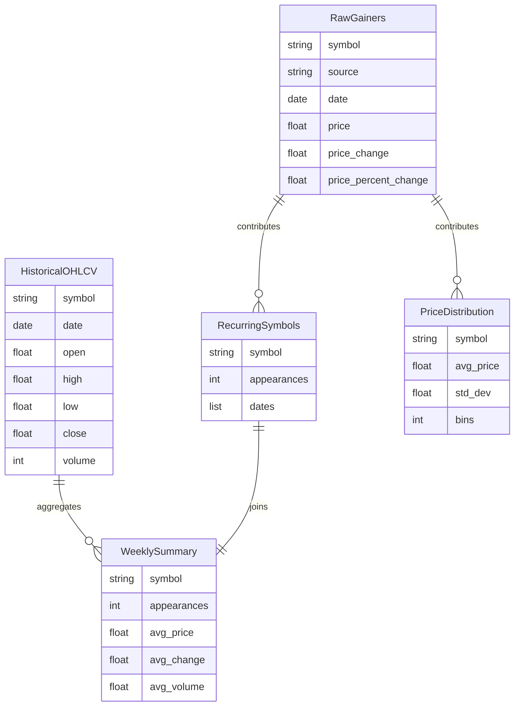

# Gainers Report: Weekly Stock Movement Analysis

---

## Overview

This report presents a summary analysis of daily stock gainer data collected from **Yahoo Finance** and the **Wall Street Journal** over the course of a week. The goal is to consolidate and process this data to uncover patterns in symbol recurrence, understand the distribution of stock prices, and provide insight into the kinds of stocks that frequently appear as top gainers.

We aim to answer questions like:

- Which symbols show up repeatedly as gainers?
- Do recurring gainers have common price behavior or volume patterns?
- What is the general price range of stocks in the gainer lists?

---

## Entity-Relationship Diagram

## Use Cases

- **Picking Recurring Stocks**  
  Identify symbols that show up across multiple days to highlight stocks with consistent positive performance signals.

- **Price Range Insights**  
  Summary tables and plots show the typical price per share, helping identify whether gainers tend to be low-cap, mid-cap, or high-cap stocks.

- **Behavior Patterns**  
  Aggregated historical OHLCV data provides clues about price momentum, volatility, and volume trends.

---

## Methods

- **Data Collection**  
  Gainer data is scraped daily from Yahoo and WSJ using automated scripts scheduled via `cron`. The raw CSVs include `symbol`, `price`, `change`, and `percent change`.

- **Normalization**  
  Both sources are normalized into a consistent schema:  
  `symbol`, `price`, `price_change`, `price_percent_change`  
  using a shared `normalize_csv.py` script.

- **Historical Data Merge**  
  For each symbol in the gainers list, a separate CSV containing historical OHLCV data is fetched and summarized to calculate weekly averages.

- **Intermediate Tables**  
  Structured tables are generated to:
  - Count symbol recurrence
  - Aggregate daily gainers into a combined table
  - Summarize price movements from candlestick data

- **Final Outputs**  
  A `weekly_gainer_summary` table joins recurrence and price behavior, making it easy to filter by frequency or volatility.

---

## Summary

This workflow successfully captures daily gainer trends and converts them into actionable summaries. The resulting intermediate and final tables allow us to identify patterns like repeated appearances, average volume, and volatility.

This makes the data immediately useful for:

- Selecting promising stocks for further analysis
- Understanding daily gainer characteristics
- Visualizing price distributions and trends

---

## Reflections

The core questions about recurrence and price behavior can be answered through a clean pipeline of scraping, normalizing, and aggregating data.

Additional data that could enhance insights:

- Sector or industry tags for each stock (e.g., tech vs healthcare)
- Pre/post-market performance
- Sentiment or news data (e.g., headlines from the day)

---

Overall, the data pipeline provides a solid foundation for spotting consistent performers and understanding the anatomy of a “gainer” over time.
