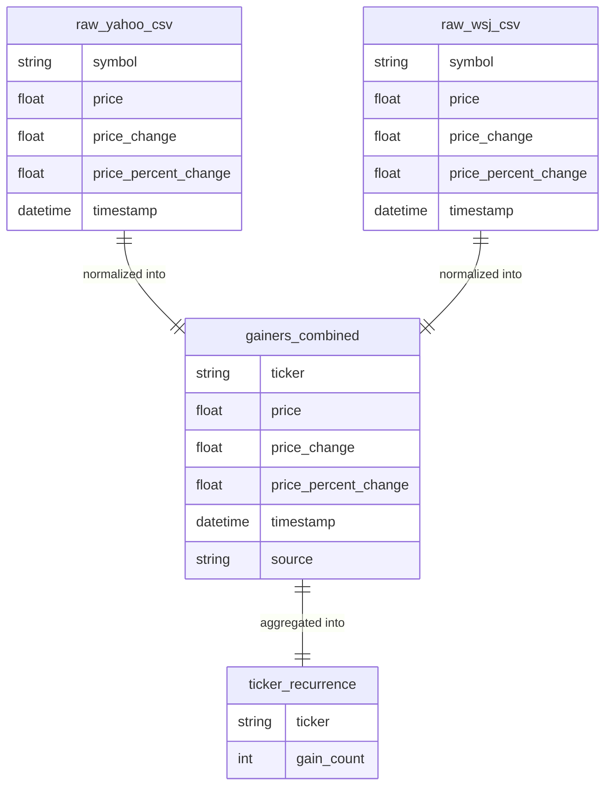

# Gainers Report: Stock Movement Analysis

---

## Overview

This report presents a summary analysis of daily stock gainer data collected from **Yahoo Finance** and the **Wall Street Journal** over several weeks. The goal is to consolidate and process this data to uncover patterns in symbol recurrence and price behavior, and to provide insight into the kinds of stocks that frequently appear as top gainers.

We aim to answer the question:

> **Which stocks appear repeatedly as top gainers?**

This exploration can offer valuable insight into market momentum, potential investor sentiment, and short-term trading opportunities. By analyzing recurrence and pricing behavior, we aim to differentiate between short-lived gainers and consistently rising performers.

---

## Entity-Relationship Diagram

---

## **Use Cases**:

### Highlight Recurring Stocks

Identify symbols that appear across multiple days as consistent gainers - these may represent companies receiving repeated investor attention or undergoing sustained price momentum.
    
### Price Range Insights
    
Understand whether recurring gainers tend to be lower-priced speculative stocks or higher-value established companies.
    
### Behavior Patterns
    
Analyze whether stocks that appear more frequently exhibit unique price movement behaviors or volatility patterns compared to one-time gainers.

---

## **Methods:**

### Data Collection

Gainer CSVs are scraped daily from Yahoo and WSJ using automated cron jobs. Each job is timestamped and saved with a consistent file naming convention, ensuring traceability and historical continuity.
    
### Normalization

Each CSV is normalized to a shared schema:
    
    	TICKER, PRICE, PRICE_CHANGE, PRICE_PERCENT_CHANGE, TIMESTAMP, SOURCE
     
This schema standardizes records across platforms and supports unified analysis. All normalized data is then loaded into a centralized Snowflake STOCKS table.

### Aggregation
	
Using SQL and Python, we compute recurrence counts for each ticker and derive rolling and cumulative price metrics. These features are essential for identifying persistent gainers.

---

## **Visual Insights:**

See attached charts:

This histogram shows the distribution of stock prices for all gainers. A majority of entries are clustered under $\$100$, reflecting the frequent volatility of lower-cap equities. However, the distribution also includes notable outliers above $\$500$, suggesting that major players also experience sharp upward movement.

This bar chart ranks the top 20 most frequent gainer tickers. Dominant names like RDDT, TSLA, and MSTR show strong price momentum and frequent trading interest. The prominence of tech and media-related stocks indicates a broader trend in sector-specific investor behavior.

These boxplots highlight the variability in stock prices based on gainer recurrence frequency. Stocks that appear more often tend to span a wider price range, with some concentrated in low-cost ranges while others reflect consistent large-cap movement. The diversity within each group points to varied market profiles among recurring gainers.

This chart visualizes the relationship between a stock’s recurrence frequency and its average price. We observe a modest upward trend in average prices for more frequent gainers, suggesting that higher-value stocks may experience more sustained upward trends, or that they are more visible to financial outlets and retail traders.

---

## **Summary:**

This analysis pipeline successfully consolidates multi-source gainer data into a unified, queryable format and surfaces trends related to ticker recurrence, price distributions, and average value behavior.

### **Key Insights:**

RDDT, TSLA, and MSTR were among the most frequent gainers during the sample period.
 
The majority of gainers are under $\$100$, but high-value outliers frequently spike.
 
Tickers with more frequent appearances tend to show slightly higher average prices and broader price variance.

---

## **Reflections:**

While this report establishes a strong baseline for gainer behavior analysis, there are several areas to expand upon:

- Incorporate sector classification: Segmenting gainers by industry could reveal sectoral momentum (e.g., tech vs. biotech).
- Analyze price volatility: Studying intra-day highs/lows and volume could deepen our understanding of momentum sustainability.
- Include sentiment or news triggers: Mapping gainer events to headlines could identify common catalysts.
- Model recurrence prediction: Using machine learning to forecast which stocks are likely to appear again could be an actionable next step.

This report offers a valuable lens into the behavior of short-term gainers and lays the groundwork for more sophisticated analysis and decision-making tools.
